# Plots 

Reference : https://python-graph-gallery.com/

## Ussage 
Download the folder in your directory 
```
from plot.colors import ALL_COLORS, lighten_color
current_path = os.getcwd()
sys.path.append(os.path.join(current_path, "plot"))
from plot.hist import bar_graph_X_Y, bar_graph_X_Y_Gradient, bar_graph_side_by_side
```

## Colors 

Best colors for paper and generating Graphs are listed in [colors.py](colors.py). 
Choose any template. 

COLOR PALLETS : were generated using https://coolors.co/palette/3a5a40-9ec7b9-bcd8e7-e58f65-e8b545-f8ddb0

[plot_utils.py](plot_utils.py) has all kind of functions to manipulate colors, generate gradient, compute contrast ratio, 


## Line Plots `test_line.py`


<div style="width: 100%;">
<!-- First row -->
<div style="display: flex; justify-content: space-between; align-items: center; margin-bottom: 1em;">
<div style="flex: 1; text-align: left;">
<p>Simple Line</p></div>
<div style="flex: 1; text-align: right;">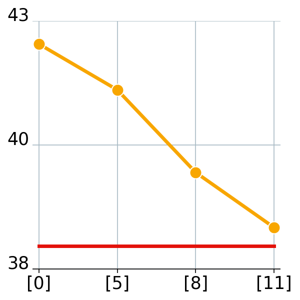</div>
</div>

<!-- Second row -->
<div style="display: flex; justify-content: space-between; align-items: center; margin-bottom: 1em;">
<div style="flex: 1; text-align: left;"><p>Line + Shade</p></div>
<div style="flex: 1; text-align: right;">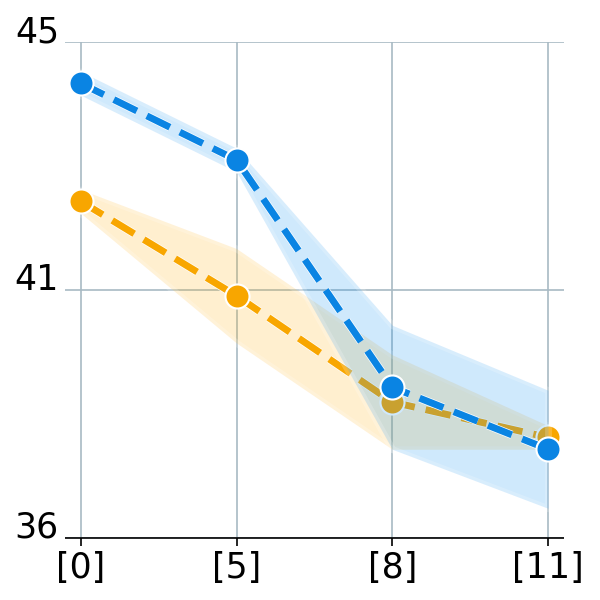</div>
</div>

<!-- Third row -->
<div style="display: flex; justify-content: space-between; align-items: center;">
<div style="flex: 1; text-align: left;"><p>Multiple Lines</p></div>
<div style="flex: 1; text-align: right;">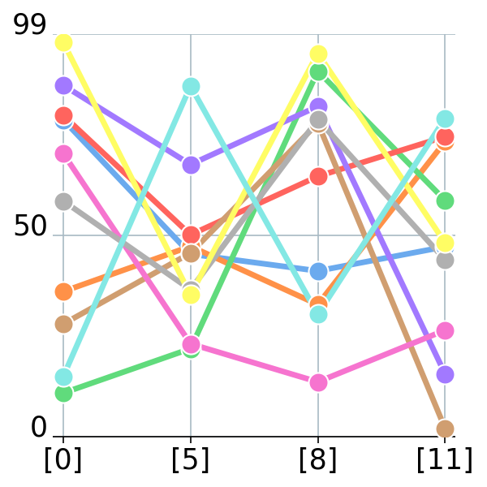</div>
</div>

</div>


## Histogram Plots `test_hist.py`

<div style="width: 100%;">

<!-- First row -->
<div style="display: flex; justify-content: space-between; align-items: center; margin-bottom: 1em;">
<div style="flex: 1; text-align: left;"><p>Simple Hist X Y</p></div>
<div style="flex: 1; text-align: right;">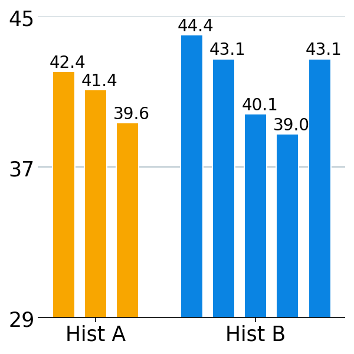</div>
</div>

  <!-- Second row -->
<div style="display: flex; justify-content: space-between; align-items: center; margin-bottom: 1em;">
<div style="flex: 1; text-align: left;"><p>Hist X Y Z (Gradient)</p></div>
<div style="flex: 1; text-align: right;">
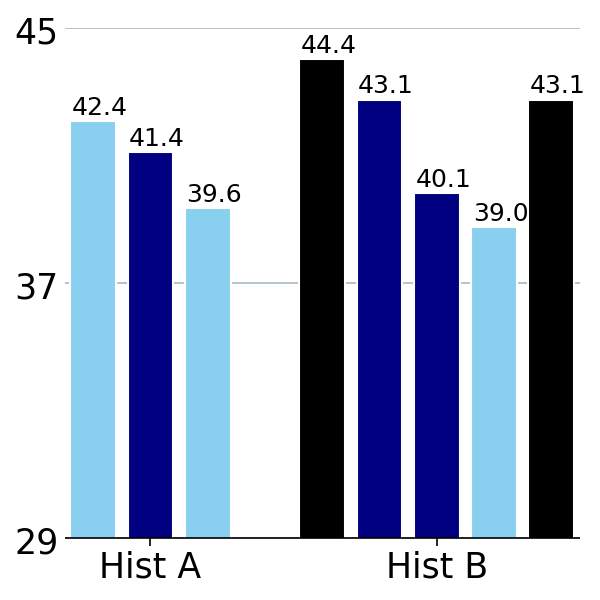</div>
</div>

 <!-- Third row -->
<div style="display: flex; justify-content: space-between; align-items: center;margin-bottom: 1em;">
<div style="flex: 1; text-align: left;"><p>Multiple Hist Side by Side</p></div>
<div style="flex: 1; text-align: right;">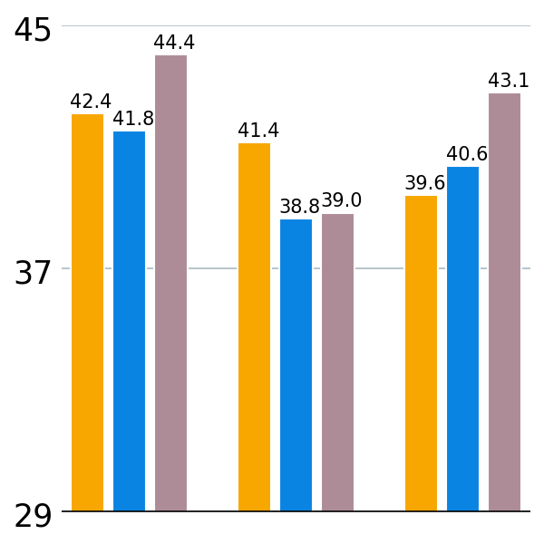</div>
</div>

<!-- Fourth row -->
<div style="display: flex; justify-content: space-between; align-items: center;margin-bottom: 1em;">
<div style="flex: 1; text-align: left;"><p>Relative Comparison</p></div>
<div style="flex: 1; text-align: right;">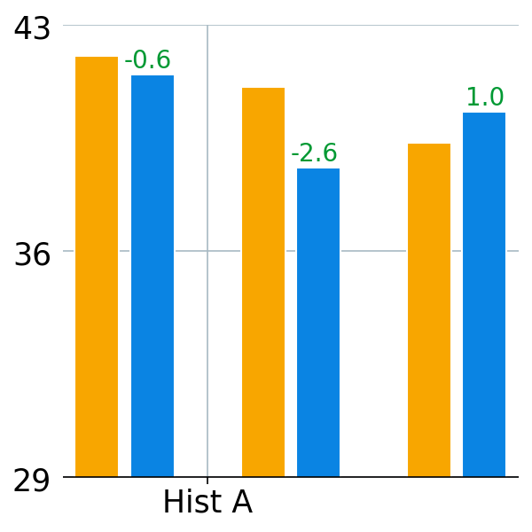</div>
</div>

<!-- Fifth row -->
<div style="display: flex; justify-content: space-between; align-items: center;margin-bottom: 1em;">
<div style="flex: 1; text-align: left;"><p>Horizontal Plots</p></div>
<div style="flex: 1; text-align: right;">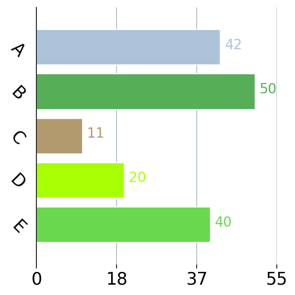</div>
</div>

</div>


## Scatter Plots `test_scatter.py`


<div style="width: 100%;">

<!-- First row -->
<div style="display: flex; justify-content: space-between; align-items: center; margin-bottom: 1em;">
<div style="flex: 1; text-align: left;"><p>Scatter Plot</p></div>
<div style="flex: 1; text-align: right;">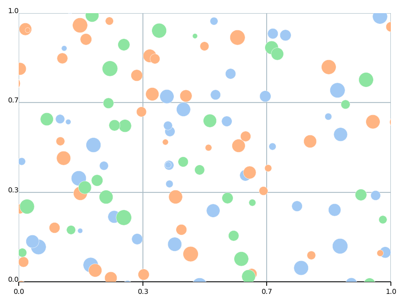</div>
</div>

</div>


## Misc `test_misc.py` : Radar, Word Cloud, Heamtmp


<div style="width: 100%;">

<!-- First row -->
<div style="display: flex; justify-content: space-between; align-items: center; margin-bottom: 1em;">
<div style="flex: 1; text-align: left;"><p>Heat Map</p></div>
<div style="flex: 1; text-align: right;">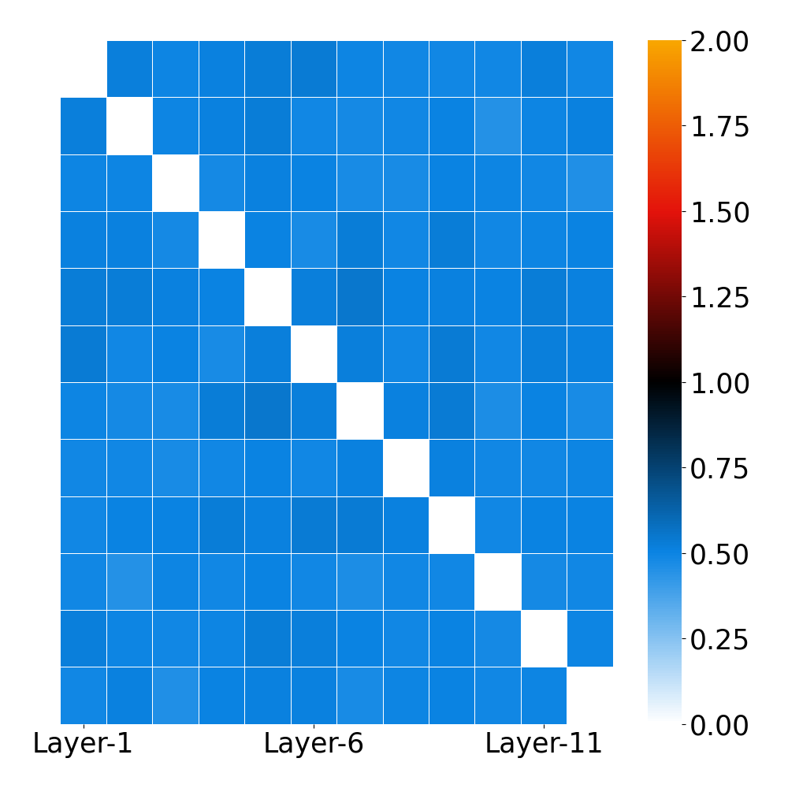</div>
</div>


<div style="display: flex; justify-content: space-between; align-items: center; margin-bottom: 1em;">
<div style="flex: 1; text-align: left;"><p>Heat Map2</p></div>
<div style="flex: 1; text-align: right;">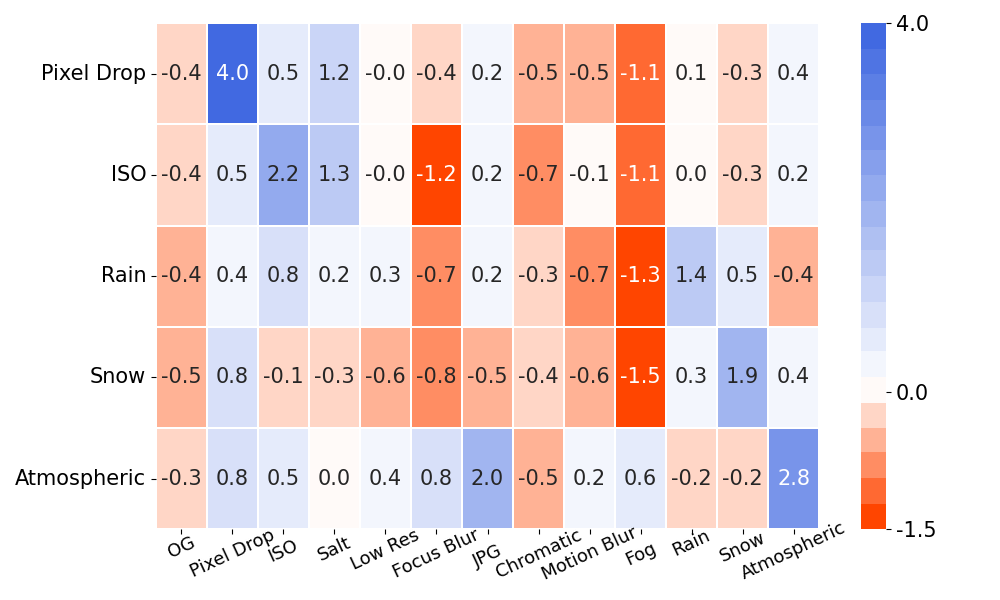</div>
</div>

<div style="display: flex; justify-content: space-between; align-items: center; margin-bottom: 1em;">
<div style="flex: 1; text-align: left;"><p>Word Cloud</p></div>
<div style="flex: 1; text-align: right;">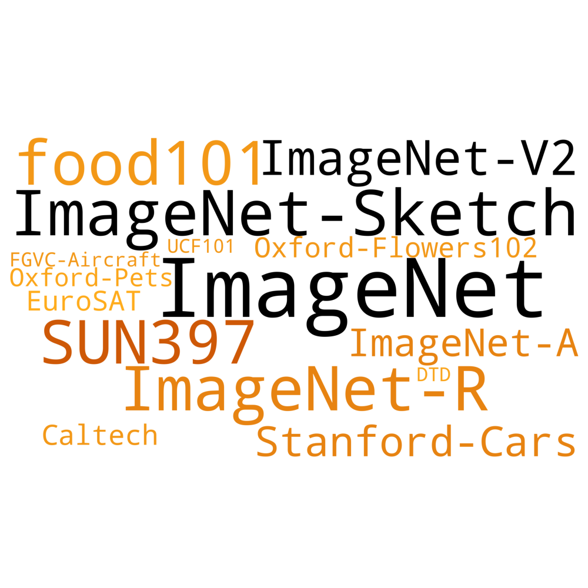</div>
</div>


<div style="display: flex; justify-content: space-between; align-items: center; margin-bottom: 1em;">
<div style="flex: 1; text-align: left;"><p>Radar Plot</p></div>
<div style="flex: 1; text-align: right;">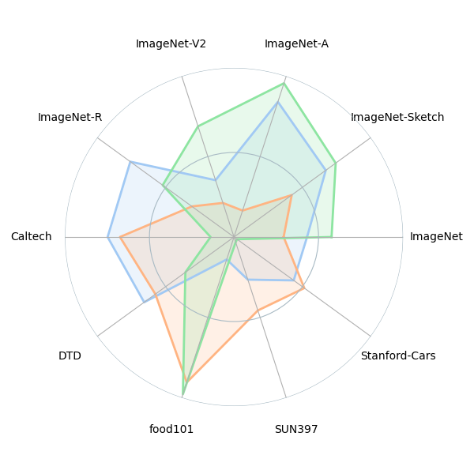</div>
</div>

<div style="display: flex; justify-content: space-between; align-items: center; margin-bottom: 1em;">
<div style="flex: 1; text-align: left;"><p>Radar Plot2</p></div>
<div style="flex: 1; text-align: right;"></div>
</div>

<div style="display: flex; justify-content: space-between; align-items: center; margin-bottom: 1em;">
<div style="flex: 1; text-align: left;"><p>Box Plot (median and qunatile)</p></div>
<div style="flex: 1; text-align: right;">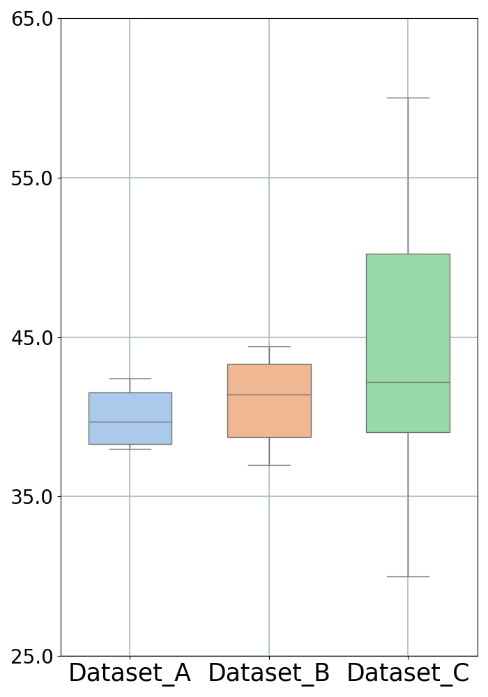</div>
</div>

<div style="display: flex; justify-content: space-between; align-items: center; margin-bottom: 1em;">
<div style="flex: 1; text-align: left;"><p>Box Plot (mean and std)</p></div>
<div style="flex: 1; text-align: right;">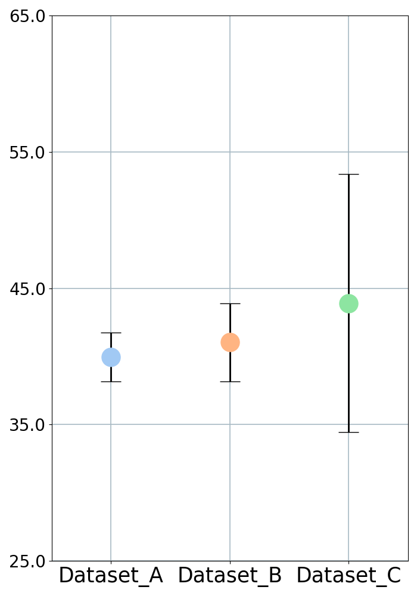</div>
</div>

<div style="display: flex; justify-content: space-between; align-items: center; margin-bottom: 1em;">
<div style="flex: 1; text-align: left;"><p>Bubble Plot (Better than Scatter) </p></div>
<div style="flex: 1; text-align: right;">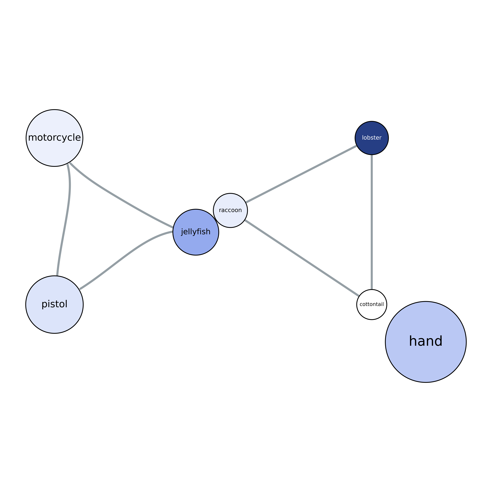</div>
</div>

</div>


  
  
  


