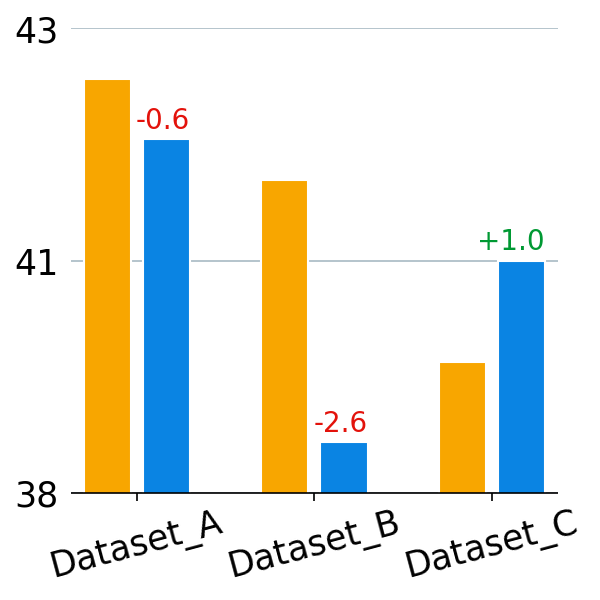

# plot

Reference : https://python-graph-gallery.com/

## Ussage 
Download the folder in your directory 
```
from plot.colors import ALL_COLORS, lighten_color
current_path = os.getcwd()
sys.path.append(os.path.join(current_path, "plot"))
from plot.hist import bar_graph_X_Y, bar_graph_X_Y_Gradient, bar_graph_side_by_side
```
## Line Plots `test_line.py`

<div style="display: flex; justify-content: space-around;">
  <div>
    <p style="text-align: center;">Simple Line</p>
        
    <p style="text-align: center;">Line + Shade</p>
        
    <p style="text-align: center;">Multiple Lines</p>
        
  </div>
</div>


## Histogram Plots `test_hist.py`

<div style="display: flex; justify-content: space-around;">
  <div>
    <p style="text-align: center;">Simple Hist X Y</p>
    
    <p style="text-align: center;">Hist X Y Z (Gradient)</p>
    
    <p style="text-align: center;">Multiple Hist Side by Side</p>
    
    <p style="text-align: center;">Relative Comparison</p>
    
    <p style="text-align: center;">Horizontal Plots</p>
    
  </div>
</div>


## Scatter Plots `test_scatter.py`

<div style="display: flex; justify-content: space-around;">
  <div>
    <p style="text-align: center;">Scatter Plot</p>
    
  </div>
</div>


## Misc `test_misc.py` : Radar, Word Cloud, Heamtmp


<div style="display: flex; justify-content: space-around;">
  <div>
    
    <p style="text-align: center;">Heat Map</p>
  </div>
  <div>
    
    <p style="text-align: center;">Heat Map</p>
  </div>
  <div>
    
    <p style="text-align: center;">Word Cloud</p>
  </div>
  <div>
    
    <p style="text-align: center;">Radar Plot</p>
  </div>
  <div>
    
    <p style="text-align: center;">Radar Plot2</p>
  </div>
  <div>
    
    <p style="text-align: center;">Box Plot (median and qunatile)</p>
    
    <p style="text-align: center;">Box Plot (mean and std)</p>
  </div>
</div>

